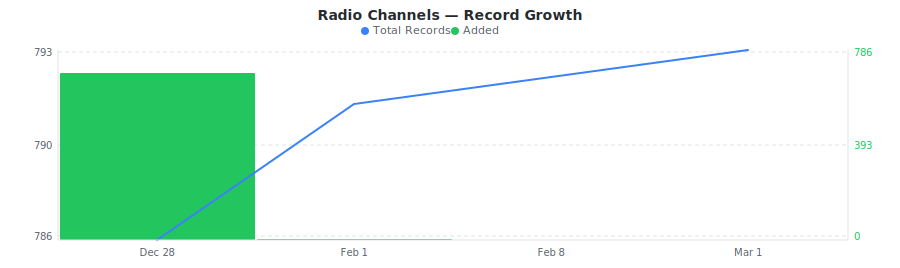
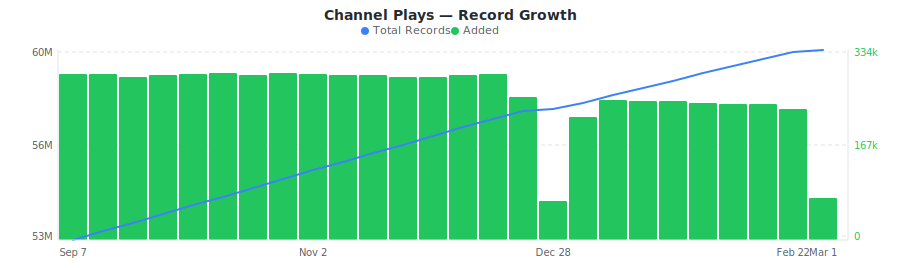

# SiriusXM Channels & Airplay Dataset

&nbsp;&nbsp;[](https://rebrowser.net/products/datasets/siriusxm)

Satellite radio channel lineup with genres, categories, channel numbers across platforms, and real-time play-by-play track history across SiriusXM music channels.


The [SiriusXM dataset](https://rebrowser.net/products/datasets/siriusxm) on Rebrowser is **free** — but GitHub has file size and storage limits, so this repo contains a limited sample. For the full dataset (59.3M records, updated daily), visit [rebrowser.net/products/datasets/siriusxm](https://rebrowser.net/products/datasets/siriusxm).


This dataset contains **2** entities, each in its own folder: Radio Channels (`channels`), Channel Plays (`channel-plays`). See below for a full field breakdown, sample counts, and data distributions for each.

*Found this useful? ⭐ Star this repo to help us keep publishing fresh data. Found an error? [Let us know](https://rebrowser.net/contact-us).*


---

### Radio Channels
SiriusXM satellite radio channels with names, channel numbers, categories, genres, descriptions, branding colors, and content flags.


> **792** total records from 2025-12-28 to 2026-02-08, **790** rows in this sample (99.7% of full dataset).
> Exported as a single file, overwritten daily.

| Field | Type | Fill Rate | Description |
| --- | --- | --- | --- |
| `_primaryKey` | `string` | 100% | Unique identifier for this record |
| `_firstSeenAt` | `datetime` | 100% | First time this record was seen |
| `_lastSeenAt` | `datetime` | 100% | Last time this record was updated |
| `channelId` | `string` | 100% | Unique channel ID (e.g., siriushits1, 8206, 9556) |
| `assetId` | `string` | 100% | Asset ID (e.g., 31NXk2ZlYdYzrF53SuFOaw) |
| `name` | `string` | 100% | Channel display name (e.g., SiriusXM Hits 1, 80s on 8) |
| `shortDescription` | `string` | 100% | Short channel description (e.g., Pop hits, now to next) |
| `mediumDescription` | `string` | 100% | Medium-length channel description |
| `longDescription` | `string` | 100% | Full channel description with details about hosts and content |
| `category` | `string` | 100% | Category slug (music, sports, entertainment, news, comedy, howard) |
| `categoryName` | `string` | 100% | Category display name (Music, Sports, Talk & Entertainment, News & Issues, Comedy, Howard Stern) |
| `genre` | `string` | 100% | Genre slug (43 values: pop, rock, hiphop, country, sportsplay, allxtra, mlbpbp, nflplay, etc.) |
| `genreName` | `string` | 100% | Genre display name (Pop, Rock, Hip-Hop/R&B, Sports Play-by-Play, etc.) |
| `genreIconUrl` | `string` | 28% | Genre icon URL (SVG) |
| `siriusChannelNumber` | `float` | 22% | Sirius satellite radio channel number |
| `xmChannelNumber` | `float` | 33% | XM satellite radio channel number |
| `streamingChannelNumber` | `float` | 90% | Streaming/app channel number |
| `siriusServiceId` | `float` | 21% | Sirius service ID |
| `xmServiceId` | `float` | 32% | XM service ID |
| `vanityUrl` | `string` | 65% | Vanity URL path (e.g., /channels/siriusxm-hits-1) |
| `deepLink` 🔒 | `string` | 97% | Deep link URL for mobile app |
| `primaryColor` | `string` | 100% | Primary brand color hex code (e.g., #ec008c) |
| `secondaryColor` | `string` | 100% | Secondary brand color hex code (e.g., #1b3588) |
| `colorLogoUrl` 🔒 | `string` | 100% | Color logo URL |
| `greyscaleLogoUrl` 🔒 | `string` | 100% | Greyscale/white logo URL |
| `explicitContent` | `bool` | 100% | Channel contains explicit content (true=Yes, false=No) |
| `availableToPackage` | `bool` | 100% | Channel is available in subscription packages |
| `exclusiveContent` | `bool` | 100% | Channel has exclusive content |
| `xtraChannel` | `bool` | 100% | Channel is an Xtra channel |
| `deliveryTypes` | `array` | 100% | Delivery methods (satellite, ip, mobile) |
| `packages` | `array` | 100% | Subscription package IDs that include this channel |
| `artistsYouHear` | `array` | 23% | Artists/hosts featured on this channel |
| `relatedChannels` | `array` | 55% | Related channel IDs |
| `showSchedules` 🔒 | `array` | 94% | Scheduled shows with showId, showName, showLogo, startTime, endTime, duration (ms) |


> 🔒 **Premium fields** are included in the data files but their values are replaced with `[PREMIUM]`. To access real values, [use our website](https://rebrowser.net/products/datasets/siriusxm).





#### Field Distributions


<details>
<summary><strong>Channels by Category</strong> (<code>categoryName</code>)</summary>


| Value | Count | Share |
| --- | --- | --- |
| Music | 440 | `███████████░░░░░░░░░` 55.6% |
| Sports | 275 | `███████░░░░░░░░░░░░░` 34.7% |
| Talk & Entertainment | 43 | `█░░░░░░░░░░░░░░░░░░░` 5.4% |
| News & Issues | 21 | `█░░░░░░░░░░░░░░░░░░░` 2.7% |
| Comedy | 11 | `░░░░░░░░░░░░░░░░░░░░` 1.4% |
| Howard Stern | 2 | `░░░░░░░░░░░░░░░░░░░░` 0.3% |

</details>


<details>
<summary><strong>Top Genres</strong> (<code>genreName</code>)</summary>


| Value | Count | Share |
| --- | --- | --- |
| Sports Play-by-Play | 69 | `███░░░░░░░░░░░░░░░░░` 16.2% |
| All Xtra | 60 | `███░░░░░░░░░░░░░░░░░` 14.1% |
| MLB Play-by-Play | 47 | `██░░░░░░░░░░░░░░░░░░` 11.1% |
| NFL Play-by-Play | 43 | `██░░░░░░░░░░░░░░░░░░` 10.1% |
| Rock | 41 | `██░░░░░░░░░░░░░░░░░░` 9.6% |
| Pop | 38 | `██░░░░░░░░░░░░░░░░░░` 8.9% |
| NHL Play-by-Play | 37 | `██░░░░░░░░░░░░░░░░░░` 8.7% |
| NBA Play-by-Play | 36 | `██░░░░░░░░░░░░░░░░░░` 8.5% |
| Party | 29 | `█░░░░░░░░░░░░░░░░░░░` 6.8% |
| Music Mash | 25 | `█░░░░░░░░░░░░░░░░░░░` 5.9% |

</details>


---

### Channel Plays
Real-time track play log for SiriusXM channels — every song played with artist, title, album, duration, and precise timestamp.


> **59,297,718** total records from 2021-10-10 to 2026-02-15, **up to 600,000** rows in this sample (1.0% of full dataset).
> Exported as one file per day, up to 10,000 rows each, last 60 days retained.

| Field | Type | Fill Rate | Description |
| --- | --- | --- | --- |
| `_primaryKey` | `string` | 100% | Unique identifier for this record |
| `playedAt` | `datetime` | 100% | Start time of the content playback (UTC) |
| `_lastSeenAt` | `datetime` | 100% | Last time this record was updated |
| `channelId` | `string` | 100% | Channel ID - numeric string or slug (e.g., 8206, 9351, siriushits1, thevault, altnation) |
| `title` | `string` | 100% | Song/content title, may include year suffix like "(98)" or markers like "EXCLUSIVE" |
| `artist` | `string` | 100% | Artist name(s) joined with " / ", may contain live show date/venue for concert recordings |
| `album` | `string` | 3% | Album title |
| `durationSeconds` | `float` | 2% | Duration in seconds with millisecond precision |
| `channelName` | `string` | — | Channel name (from channels table) |
| `channelCategoryName` | `string` | — | Channel category (from channels table) |
| `channelGenreName` | `string` | — | Channel genre (from channels table) |





---

## Pre-built Views on Rebrowser

Rebrowser web viewer lets you filter, sort, and export any slice of this dataset interactively. These pre-built views are ready to open:


### Radio Channels


[Music Channels](https://rebrowser.net/products/datasets/siriusxm/channels/views/music-channels) — 440 records

↳ `[{"field":"categoryName","op":"is","value":"Music"},{"sort":"name ASC"}]`

[Sports Channels](https://rebrowser.net/products/datasets/siriusxm/channels/views/sports-channels) — 274 records

↳ `[{"field":"categoryName","op":"is","value":"Sports"},{"sort":"name ASC"}]`

[Xtra Streaming-Only Channels](https://rebrowser.net/products/datasets/siriusxm/channels/views/xtra-streaming-channels) — 60 records

↳ `[{"field":"genreName","op":"is","value":"All Xtra"},{"sort":"name ASC"}]`

[Talk & Entertainment Channels](https://rebrowser.net/products/datasets/siriusxm/channels/views/talk-entertainment-channels) — 43 records

↳ `[{"field":"categoryName","op":"is","value":"Talk & Entertainment"},{"sort":"name ASC"}]`

[NFL Play-by-Play Channels](https://rebrowser.net/products/datasets/siriusxm/channels/views/nfl-channels) — 43 records

↳ `[{"field":"genreName","op":"is","value":"NFL Play-by-Play"},{"sort":"name ASC"}]`


*[See all 35 views →](https://rebrowser.net/products/datasets/siriusxm/channels)*


### Channel Plays


[Recent Track Plays](https://rebrowser.net/products/datasets/siriusxm/channel-plays/views/recent-plays) — 58,741,510 records

↳ `[{"sort":"playedAt DESC"}]`

[Plays with Album Metadata](https://rebrowser.net/products/datasets/siriusxm/channel-plays/views/plays-with-albums) — 1,204,082 records

↳ `[{"field":"album","op":"isNotEmpty"},{"sort":"playedAt DESC"}]`

[Music Channel Plays](https://rebrowser.net/products/datasets/siriusxm/channel-plays/views/music-channel-plays) — 54,399,706 records

↳ `[{"field":"channelCategoryName","op":"is","value":"Music"},{"sort":"playedAt DESC"}]`

[Pop Channel Plays](https://rebrowser.net/products/datasets/siriusxm/channel-plays/views/pop-channel-plays) — 14,420,011 records

↳ `[{"field":"channelGenreName","op":"is","value":"Pop"},{"sort":"playedAt DESC"}]`

[Long-Form Content (5+ Min)](https://rebrowser.net/products/datasets/siriusxm/channel-plays/views/long-form-content) — 117,075 records

↳ `[{"field":"durationSeconds","op":"gt","value":300},{"sort":"playedAt DESC"}]`


*[See all 33 views →](https://rebrowser.net/products/datasets/siriusxm/channel-plays)*


---

## Code Examples

```python
import pandas as pd

# ── Channels ─────────────────────────────────────────────────────────────────
channels = pd.read_parquet('rebrowser/siriusxm-dataset/channels/data.parquet')

# Count channels by category
print(channels['categoryName'].value_counts().to_string())

# All Pop genre channels sorted by name
pop = channels[channels['genreName'] == 'Pop']
print(pop[['name', 'siriusChannelNumber', 'xmChannelNumber', 'shortDescription']]
      .sort_values('name').to_string(index=False))

# Streaming-only Xtra channels
xtra = channels[channels['xtraChannel'] == True]
print(f"Xtra streaming-only channels: {len(xtra)}")
print(xtra[['name', 'genreName', 'streamingChannelNumber']].sort_values('name').to_string(index=False))

# ── Channel Plays ────────────────────────────────────────────────────────────
from pathlib import Path

# Load the last 7 days of play history
files = sorted(Path('rebrowser/siriusxm-dataset/channel-plays/data').glob('*.parquet'))[-7:]
plays = pd.concat([pd.read_parquet(f) for f in files])

# Most-played artists across SiriusXM
print(plays.groupby('artist').size().sort_values(ascending=False).head(20).to_string())

# Average track duration by channel
print(plays.groupby('channelId')['durationSeconds'].mean()
      .sort_values(ascending=False).head(10).to_string())

# Search for a specific song
print(plays[plays['title'].str.contains('Flowers', case=False, na=False)]
      .groupby('artist')['title'].count())
```

---

## Use Cases


### Satellite Radio Content Analysis

Explore channel genre distribution, content classification, and lineup composition across SiriusXM satellite and streaming tiers. Identify how music, sports, talk, and comedy content is packaged.


### Airplay Tracking

Monitor which artists and songs get the most spins on SiriusXM music channels. Compare play frequency across genres and track how new releases enter rotation over time.


### Channel Lineup Intelligence

Analyze channel numbers, category assignments, and Xtra streaming-only expansion. Track lineup changes and channel additions as SiriusXM evolves its content strategy.


### Audio Platform Comparison

Benchmark SiriusXM genre coverage and programming breadth against terrestrial radio and streaming services. Quantify content diversity by category and track playlist curation patterns.


---

## Full Dataset on Rebrowser


This repo publishes free research data (14 days freshness lag · up to 10,000 rows per file · up to 1 year of history). The complete, real-time dataset is at [rebrowser.net/products/datasets/siriusxm](https://rebrowser.net/products/datasets/siriusxm)

On Rebrowser you can:
- **Filter before you buy** — use the web UI to apply filters on any field and sort by any column. Preview results before purchasing. You only pay for records that match your criteria.
- **Export in your format** — CSV, JSON, JSONL, or Parquet depending on your plan.
- **Access via API** — integrate dataset queries into your pipelines and workflows.
- **Choose your freshness** — plans range from a 14-day lag to real-time data with no delay.
- **Select only the fields you need** — keep exports lean. Premium fields with richer data are available on higher plans.

[Pricing](https://rebrowser.net/pricing) starts at **$2 per 1,000 rows** with volume discounts.

---

## License & Terms

**Free for research and non-commercial use** with attribution. See [license terms](https://rebrowser.net/free-datasets-for-research#license) and [how to cite](https://rebrowser.net/free-datasets-for-research#citation).

```bibtex
@misc{rebrowser_siriusxm,
  author       = {Rebrowser},
  title        = {SiriusXM Channels & Airplay Dataset},
  year         = {2026},
  howpublished = {\url{https://rebrowser.net/products/datasets/siriusxm}},
  note         = {Accessed: YYYY-MM-DD}
}
```

Commercial use requires a paid license — see [pricing](https://rebrowser.net/pricing). Use of this data is governed by the [Rebrowser Terms of Use](https://rebrowser.net/terms-of-use), which may be updated at any time independently of this repository.

---

## Disclaimer

Rebrowser is an independent data provider and is not affiliated with, endorsed by, or sponsored by SiriusXM. Any trademarks are the property of their respective owners. This dataset is compiled from publicly available information; we do not request or collect SiriusXM user credentials. By using this dataset, you agree to comply with SiriusXM's Terms of Service and all applicable laws and regulations. Images, logos, descriptions, and other materials included in this dataset remain the intellectual property of their respective owners and are provided solely for informational purposes. Rebrowser makes no warranties regarding the accuracy, completeness, or legality of the data and assumes no liability for how the data is used. You are solely responsible for ensuring that your use of this dataset does not infringe on the rights of any third party.

